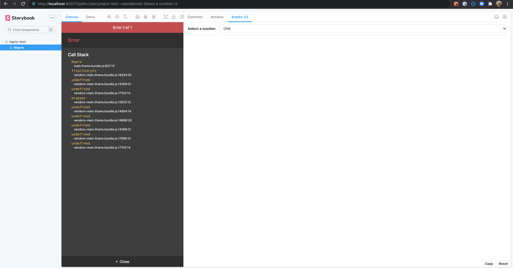

# Storybook Knobs Copy Bug

This repo contains a reproduction of an issue where the copy URL function in the knobs addon looses the type information of values, resulting in crashes when a number is expected but a string is received instead.

## Reproduction Steps

1. Clone repo, install dependencies
2. `npm run storybook`
3. Change knob value
4. Copy URL
5. Navigate to copied URL, observe error.

